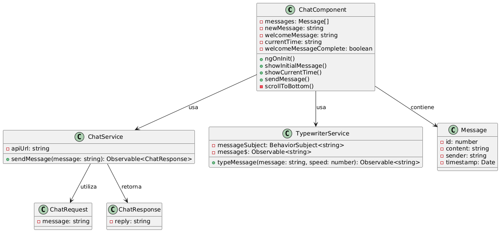
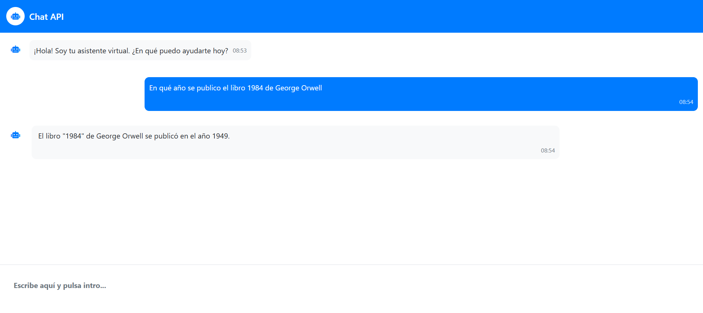

## AngularChatAPI

**AngularChatAPI** is an interactive chat system with visual effects that simulates a conversation through a REST API, using Angular 20.1.2 as its main framework. The project includes typewriter effects to create a more immersive chat experience, uses PrimeNG for UI components, RxJS for reactive programming and TypeScript 5.8.3.



AngularChatAPI/  
├───app/  
│   ├───components/  
│   │   ├───chat/  
│   │   │   ├───chat.css  
│   │   │   ├───chat.html  
│   │   │   └───chat.ts   
│   ├───interfaces/  
│   │   ├───chat.interface.ts  
│   │   └───message.interface.ts  
│   ├───services/  
│   │   ├───chat.ts  
│   │   └───typewriter.ts   
│   ├───app.html  
│   ├───app.ts  
├───main.ts      
├───angular.json   
└───package.json 





[DeepWiki moraisLuismNet/AngularChatAPI_20](https://deepwiki.com/moraisLuismNet/AngularChatAPI_20)

## API Configuration
The chat service is configured to connect to:
```
https://localhost:7274/api/chat
```

**Note**: Make sure your backend API is running at this URL before using the application.

## Installation and Usage

### Installation Steps

1. **Clone the repository**
```bash
git clone https://github.com/moraisLuismNet/AngularChatAPI_20.git
cd AngularChatAPI_20
```

2. **Install dependencies**
```bash
npm install
```

3. **Start the development server
```bash
npm start
# or alternatively
ng serve
```

4. **Open your browser**
Navigate to `http://localhost:4200/`

